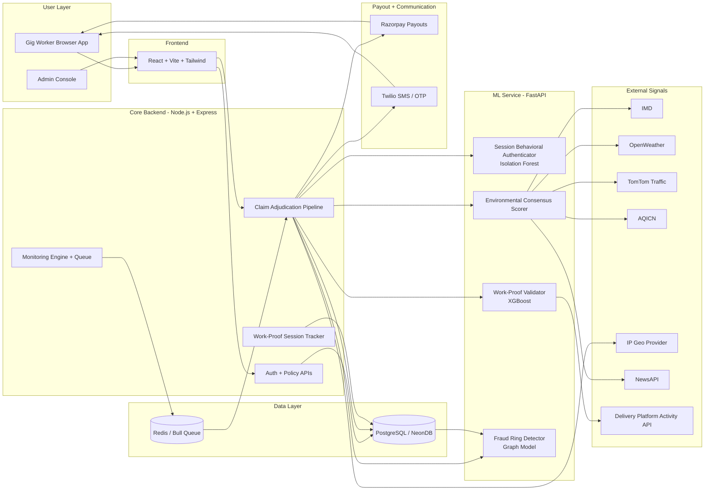

# 🔐 KavachPay — Work-Proof Parametric Insurance for India's Gig Economy

> *"Don't trust location. Trust behavior. Trust work. Trust truth."*


---

## 📌 Table of Contents

1. [The Core Innovation — Work-Proof Protocol](#core-innovation)
2. [The Problem — Beyond the Obvious](#the-problem)
3. [Why Every Other Solution Fails](#why-others-fail)
4. [KavachPay's Answer — Three Pillars](#kavachpay-answer)
5. [Primary Persona — Arjun's Story](#persona)
6. [The Work-Proof Engine](#work-proof-engine)
7. [AI/ML Architecture — 4 Specialized Models](#aiml)
8. [Adversarial Defense & Anti-Spoofing Strategy](#adversarial-defense)
9. [Web Application — Pages & Features](#web-app)
10. [Application Workflow](#workflow)
11. [Tech Stack](#tech-stack)
12. [External APIs & Integrations](#apis)
13. [System Architecture](#architecture)
14. [Folder Structure](#folder-structure)
15. [Business Model](#business-model)

---

## ⚡ The Core Innovation — Work-Proof Protocol <a name="core-innovation"></a>

Every existing parametric insurance platform — including the one exploited in the DEVTrails crisis scenario — makes **one fatal assumption:**

> *"If GPS says a worker is in a disruption zone, they  must be there."*

**KavachPay rejects this assumption entirely.**

We invented the **Work-Proof Protocol (WPP)** — a behavioral fingerprinting system that builds a tamper-evident digital proof of a worker's real activity, verified entirely through the browser and server-side signals. No GPS trust. No single point of failure.

```
Traditional Platforms:          KavachPay:
─────────────────────           ──────────────────────────────────
GPS Location → Trust            Work Behavior → Verify → Trust
     ↓                                ↓
 Spoofable ❌                   High-Cost to Spoof ✅
```

The core insight: **You can fake where you are. Faking sustained work behavior across multiple independent signals is far harder.**

A real delivery worker's browser session produces dozens of verifiable signals — login timestamps aligned with peak delivery hours, order history activity, IP geolocation cross-matched against registered city, browser interaction patterns during active work hours, and real-time delivery platform activity drops during disruptions. These form a **behavioral work fingerprint** that no Telegram syndicate can coordinate at scale.

---

## 🚨 The Problem — Beyond the Obvious <a name="the-problem"></a>

India's **~15 million gig delivery workers** face two simultaneous crises:

### Crisis 1 — Income Vulnerability

```
Disruption Event          Frequency/Year    Avg. Daily Loss
────────────────────────  ────────────────  ───────────────
Heavy Rainfall (>65mm)    40–50 days        ₹800 – ₹1,200
Extreme Heat (>44°C)      15–25 days        ₹600 – ₹900
Floods / Road Closure     10–15 days        ₹900 – ₹1,400
Curfews / Strikes         5–10 days         ₹1,000 – ₹1,500
────────────────────────────────────────────────────────────
Estimated Annual Loss Per Worker:  ₹35,000 – ₹60,000
```

No existing product protects against this. Traditional insurance is too slow and paperwork-heavy. Delivery platforms offer zero compensation.

### Crisis 2 — The Fraud Problem That Kills Every Solution

As proven by the DEVTrails 2026 crisis scenario, every parametric platform built on GPS verification is **one Telegram group away from collapse.**

500 workers. GPS spoofing apps. Coordinated timing. Liquidity pool drained in hours.

Fraud does not just hurt insurers — **it kills the product for the honest majority.** When platforms lose money to fraud, they raise premiums until genuine workers cannot afford coverage.

**KavachPay solves both crises simultaneously** with the Work-Proof Protocol.

---

## ❌ Why Every Other Solution Fails <a name="why-others-fail"></a>

| Approach | The Fatal Flaw |
|---|---|
| GPS-only verification | Trivially spoofed with a free app |
| Weather API cross-check | Spoofed GPS queries the same weather API |
| Speed consistency check | Spoofers can simulate fake movement |
| Device mock-location flag | Rooted phones bypass Android's mock flag |
| Claim frequency limits | Syndicate distributes across 500 accounts |
| Manual review | Does not scale, introduces bias, delays honest claims |

Every existing approach fights the spoofer on the spoofer's terrain — the GPS signal. KavachPay moves the battlefield to **server-side behavioral verification** that no client-side app can manipulate.

---

## ✅ KavachPay's Answer — Three Pillars <a name="kavachpay-answer"></a>

```
┌─────────────────────────────────────────────────────────────────┐
│                    KAVACHPAY TRUST PILLARS                      │
│                                                                 │
│  PILLAR 1              PILLAR 2              PILLAR 3           │
│  Work-Proof            Environmental         Behavioral         │
│  Protocol              Consensus             Session Analysis   │
│                                                                 │
│  Proves the worker     Proves the            Proves this is     │
│  was actively          disruption            a genuine active   │
│  working               actually happened     work session       │
│                                                                 │
│  Login timestamps +    IMD + OpenWeather     Session duration + │
│  Order activity +      + TomTom +            Click patterns +   │
│  IP consistency +      AQICN +               Active hours +     │
│  Work hour alignment   NewsAPI               Platform activity  │
│                                                                 │
│  All 3 must confirm. Any single failure = investigation.       │
└─────────────────────────────────────────────────────────────────┘
```

---

## 👤 Primary Persona — Arjun's Story <a name="persona"></a>

```
┌──────────────────────────────────────────────────────────┐
│  ARJUN MEHTA                                             │
│  Age: 24  |  Zomato Partner  |  Bengaluru               │
│  Vehicle: Two-wheeler (Honda Activa)                     │
│  Weekly Earnings: ₹5,500 – ₹8,000                       │
│  Device: Laptop / Smartphone browser                     │
│                                                          │
│  "Some days I ride through rain for 6 hours.            │
│   Some days the rain stops me entirely.                 │
│   Either way, I am on my own."                          │
└──────────────────────────────────────────────────────────┘
```

### Arjun's Tuesday — A Monsoon Event

**Without KavachPay:**
```
6:30 PM  Arjun logs into Zomato. Picks up orders.
7:15 PM  Massive rainfall hits Bengaluru. Roads flood.
7:20 PM  Zomato suspends deliveries in his zone.
7:21 PM  Arjun earns ₹0 for the next 4 hours.
11:00 PM Arjun goes home. ₹0 earned in peak hours.
          Rent is due Friday.
```

**With KavachPay:**
```
6:30 PM  Arjun logs into KavachPay dashboard.
          Work-Proof session starts passively.
7:15 PM  Rainfall hits. Environmental Consensus Engine:
          IMD ✅   OpenWeather ✅   TomTom congestion ✅
7:16 PM  Work-Proof confirmed: Arjun was logged in
          and active during peak delivery hours.
          Session signals align with genuine work. ✅
7:17 PM  Behavioral session check: same user confirmed. ✅
7:18 PM  Claim auto-triggered. Fraud score: 0.04 (clean).
7:19 PM  ₹850 credited to Arjun's UPI via Razorpay.
7:19 PM  Dashboard notification + SMS via Twilio sent.
          Arjun did nothing. The system handled it all.
```

---

## 🔧 The Work-Proof Engine <a name="work-proof-engine"></a>

The Work-Proof Engine runs server-side and builds a **tamper-evident digital proof** of each worker's active session. Since it lives on the backend, client-side GPS spoofers cannot directly manipulate these records and must resort to more detectable high-cost evasion methods.

### What Gets Recorded Per Session (Every 5 Minutes)

```
Work-Proof Session Record {
  worker_id:              UUID (registered user)
  session_start:          timestamp (server-side, difficult to backdate)
  session_active_minutes: total active time on dashboard
  login_hour:             aligns with typical work hours?
  ip_address:             consistent with registered city?
  ip_geolocation:         city-level match (not GPS — ISP-based)
  browser_activity:       page interactions, tab focus events
  platform_active_flag:   delivery platform API shows active orders?
  work_hour_alignment:    is this a peak delivery time window?
  session_hash:           SHA-256 of all above fields
}
```

### Why IP Geolocation + Session Timing Is the Web's Secret Weapon

On the web, we cannot use cell towers directly — but we have equally powerful server-side signals:

**IP Geolocation:** When Arjun logs into KavachPay, his IP address reveals his city-level location via ISP data. This is:
- Completely independent of GPS
- Not affected by a GPS spoofing app
- Verifiable server-side — the client never touches this logic

```
Real Arjun (Bengaluru worker):
IP: 49.36.x.x → ISP: Jio Bengaluru → City: Bengaluru ✅
Registered city: Bengaluru ✅ → Match confirmed

GPS Spoofer (pretending to be in flood zone):
GPS says: Flood Zone, Whitefield, Bengaluru
IP says:  103.21.x.x → ISP: Airtel Mumbai → City: Mumbai ❌
→ City mismatch detected → FLAGGED
```

**Session Timing Analysis:** Real delivery workers log in during peak hours (lunch: 12–2 PM, dinner: 7–10 PM). A fraudster logging in at 3 AM to claim a flood event is immediately suspicious.

### Session Signing and Tamper Detection

Every 5-minute Work-Proof chunk is signed server-side:

```
session_block_N.hash = SHA256(
  session_block_N.data +
  session_block_(N-1).hash +   ← links to previous block
  server_secret_key             ← never exposed to client
)
```

Client cannot forge, modify, or replay session blocks. The chain is maintained entirely on the server.

---

## 🤖 AI/ML Architecture — 4 Specialized Models <a name="aiml"></a>

### Model 1 — Session Behavioral Authenticator

**Purpose:** Confirm the logged-in user matches their registered behavioral profile.

At registration, the system builds a baseline from the worker's first 3 sessions:
- Time-of-day login patterns
- Average session duration
- Page navigation sequence (dashboard → policy → history)
- Click frequency and idle time ratio

At claim time, current session is compared against baseline.

```python
# Conceptual feature set
features = {
    'login_hour_deviation':      abs(current_hour - avg_login_hour),
    'session_duration_zscore':   zscore(session_minutes, history),
    'page_nav_similarity':       cosine_sim(current_nav, baseline_nav),
    'idle_ratio':                idle_time / total_session_time,
    'ip_city_match':             registered_city == ip_city,
    'work_hour_alignment':       is_peak_delivery_hour(login_time),
}

authenticity_score: float  # 0.0 to 1.0
# > 0.80 → same user confirmed
# < 0.80 → secondary verification triggered
```

**Algorithm:** Isolation Forest for anomaly detection on session features.

---

### Model 2 — Work-Proof Validator

**Purpose:** Confirm the worker was genuinely active (not just logged in, AFK) at the time of disruption.

```python
work_proof_features = {
    'session_active_minutes':     active_interaction_time,
    'login_to_disruption_gap':    minutes_logged_in_before_event,
    'platform_activity_signal':   delivery_app_api_active_flag,
    'work_hour_alignment_score':  peak_hour_confidence,
    'ip_consistency_score':       ip_city_matches_registered,
    'session_continuity':         no_large_gaps_in_activity,
    'historical_work_pattern':    matches_90day_behavior,
}

output:
  work_proof_score: float    # 0.0 to 1.0
  was_working: bool
  disruption_overlap_minutes: int
```

**Algorithm:** XGBoost Classifier trained on labeled session data.

---

### Model 3 — Environmental Consensus Engine

**Purpose:** Confirm the disruption actually happened using sources that are independent of the worker device and therefore much harder to spoof at scale.

```
SOURCE TIER 1 (Satellite / Physical Infrastructure — Cannot be device-spoofed):
  ├── IMD (India Meteorological Department) — government satellite data
  ├── TomTom physical traffic sensors
  └── AQICN ground-level air quality stations

SOURCE TIER 2 (API-based — Cross-validated against Tier 1):
  ├── OpenWeather API
  └── NewsAPI (for curfews/strikes)

CLAIM APPROVED ONLY IF:
  Tier 1 confirms event AND Tier 2 corroborates.
  Worker's registered city must match the disruption zone.
  IP geolocation must be consistent with registered city.
```

---

### Model 4 — Fraud Ring Detector (Graph Neural Network)

**Purpose:** Detect coordinated syndicates — the exact 500-worker Telegram attack from the crisis scenario.

**Architecture:** Graph Neural Network where each node is one worker's claim session and each edge represents shared signals (same IP subnet, same login timestamp cluster, identical session patterns).

```
Step 1: Build claim graph for the last 10-minute window
Step 2: Detect dense clusters (>20 nodes, high edge density)
Step 3: Compute per-cluster features:
        ├── IP subnet diversity (real workers = diverse ISPs)
        ├── Session pattern similarity (fake = nearly identical)
        ├── Login timestamp entropy (coordinated = near-zero)
        ├── Work-Proof score variance (real workers vary)
        └── Registration date clustering (syndicate registers together)
Step 4: GNN classifies cluster as organic vs. coordinated fraud
Step 5: Flag cluster → pause payouts → human review
```

**Why this catches the Telegram syndicate:**
- 500 workers on same IP subnet or ISP block → near-zero IP diversity
- All logging in within the same 5-minute window → zero timestamp entropy
- Session patterns are nearly identical (same script, same bot) → high similarity score
- None show genuine work-hour alignment or platform activity signals

---

## 🛡️ Adversarial Defense & Anti-Spoofing Strategy <a name="adversarial-defense"></a>

> *Direct response to the DEVTrails 2026 Market Crash Scenario: 500 GPS-spoofing workers organized via Telegram draining a parametric insurance liquidity pool.*

### Threat Model

We assume attackers who can:
- Install and run any GPS spoofing application on their phone
- Coordinate hundreds of accounts via encrypted messaging (Telegram)
- Create multiple fake accounts (Sybil attacks)
- Automate claim submissions using bots or scripts
- Operate at scale with synchronized timing

We assume the following actions are possible in theory but high-cost, inconsistent at scale, and detectable in practice:
- Hiding real network provenance long-term without triggering VPN/proxy/anomaly signals
- Replicating a registered user's behavioral session fingerprint across many accounts
- Influencing IMD satellite signals and TomTom physical sensor outputs
- Producing valid cryptographically-chained Work-Proof sessions from bot-driven flows
- Coordinating 500 unique, realistic behavioral profiles with natural variance

---

### 1. Differentiation: Genuine Worker vs. Bad Actor

The fundamental shift: KavachPay asks not *"Where is this person?"* but *"Can this person prove their browser session shows genuine work activity?"*

```
┌────────────────────────────────────────────────────────────────┐
│           SIGNAL PROFILE: REAL ARJUN vs. GPS SPOOFER          │
│                                                                │
│  Signal                    Real Arjun        GPS Spoofer      │
│  ───────────────────────   ─────────────     ─────────────    │
│  GPS Coordinates           Authentic ✅      FAKED ❌         │
│  IP Geolocation City       Bengaluru ✅      Mumbai ❌        │
│  Session Login Hour        7 PM ✅           3 AM ❌          │
│  Work-Proof Active Time    45 min ✅         0 min ❌         │
│  Platform Activity Signal  Orders active ✅  No signal ❌     │
│  Session Behavioral Match  Matches ✅        Bot pattern ❌   │
│  Work-Proof Chain Hash     Valid ✅          Broken ❌        │
│  IMD Weather (satellite)   Rain confirmed ✅ Cannot fake ✅   │
│  TomTom Congestion         High ✅           Independent ✅   │
│  Claim Cluster             Isolated ✅       500 workers ❌   │
└────────────────────────────────────────────────────────────────┘
```

**The Spoofing Paradox on the Web:**
A fraudster using a GPS spoofer on their phone can fake their device location — but when they open KavachPay in a browser, their **real IP address hits our server**. Our backend sees Mumbai ISP while their GPS says Bengaluru flood zone. This mismatch alone flags the claim for review before any ML model even runs.

---

### 2. Data Points Beyond GPS

KavachPay analyzes **10 independent signal categories** — all server-side or from external sources that are independent of worker-device GPS:

| # | Signal | Source | Spoofable by GPS app? | What It Catches |
|---|---|---|---|---|
| 1 | **IP Geolocation City** | ISP / MaxMind DB | No | Remote fraudsters in different cities |
| 2 | **Session Login Timestamp** | Server-side clock | No | Off-hours bot submissions |
| 3 | **Work-Proof Active Minutes** | Server session tracking | No | AFK / bot sessions |
| 4 | **Work Hour Alignment** | Business logic | No | Claims outside delivery hours |
| 5 | **Platform Activity Signal** | Delivery API proxy | No | No real orders in their system |
| 6 | **Session Behavioral Pattern** | Isolation Forest | No | Bot-like navigation patterns |
| 7 | **Work-Proof Chain Hash** | Server-side SHA-256 | No | Tampered or injected sessions |
| 8 | **IMD Satellite Data** | Government API | No | Weather event authenticity |
| 9 | **Claim Timestamp Entropy** | GNN backend | No | Coordinated Telegram attacks |
| 10 | **IP Subnet Cluster Score** | GNN backend | No | Fraud ring from same network |

Signals 1, 2, 3, 7, 8, 9, and 10 are materially more resistant to client-side GPS spoofing and raise attacker cost significantly.

---

### 3. UX Balance — Protecting Honest Workers

#### Three-Tier Adjudication (No Single Signal Rejection)

```
┌──────────────────────────────────────────────────────────────────┐
│                   KAVACHPAY CLAIM ADJUDICATION                   │
│                                                                  │
│  Claim Received                                                  │
│       │                                                          │
│       ▼                                                          │
│  Work-Proof > 0.7? Session Auth > 0.80?                         │
│  Environmental Consensus? Ring Score < 0.2?                      │
│                                    YES ──────────► INSTANT      │
│                                                   PAYOUT ✅     │
│       │ Partial / Mixed signals                   < 60 sec      │
│       ▼                                                          │
│  Fraud Score 0.2 – 0.6?       ──────────────────► AUTOMATED    │
│       │                        Secondary checks:   REVIEW ⚠️   │
│       │                        IP re-validation    4 hours      │
│       │                        2nd weather source              │
│       │                        40% advance payout now          │
│       │                        60% on resolution               │
│       ▼                                                          │
│  Fraud Score > 0.6?           ──────────────────► HUMAN        │
│                                Analyst assigned    REVIEW 🔍    │
│                                Worker uploads      24 hours     │
│                                proof document                   │
└──────────────────────────────────────────────────────────────────┘
```

#### Safeguards for Honest Workers

**VPN / Proxy Protection:** Some workers use VPNs. If a VPN is detected, IP geolocation is deprioritized and other signals take precedence. VPN usage alone is never grounds for rejection.

**New Zone Protection:** Workers who travel to a new city for work get a 48-hour grace window where IP-city mismatch threshold is relaxed by 20%.

**Partial Advance Payout:** Any claim under review receives 40% of coverage immediately. No worker waits with zero funds.

**Transparent Communication:** Every flagged claim sends an SMS explaining the reason, expected resolution time, and advance payout amount.

**Trust Score:** Clean claim history builds a Trust Score. After 3 months, medium-risk claims are auto-approved.

**Document Upload Appeal:** Rejected claims can be appealed by uploading a delivery platform screenshot or any proof of active work session that day.

---

### Fraud Ring Response Protocol

```
T + 0:00   GNN cluster anomaly score > 0.85 detected
T + 0:01   All payouts for cluster PAUSED (not rejected)
T + 0:02   Automated Work-Proof re-validation for each worker
T + 0:15   Workers with valid Work-Proof chains: payout RELEASED
T + 0:30   Remaining flagged workers: human analyst assigned
T + 4:00   Individual decisions made per worker
            Genuine workers: full payout + apology notification
            Bad actors: rejected + account suspended
T + 24:00  Fraud pattern fed into GNN training data
T + 48:00  Model retrained with updated attack signature
```

---

## 🌐 Web Application — Pages & Features <a name="web-app"></a>

KavachPay is a **React web application** accessible from any browser on desktop or mobile. No app download required — workers simply open the website.

### Pages Overview

```
/                      → Landing Page (hero, how it works, plans)
/register              → Worker Registration
/login                 → Login (OTP via phone)
/dashboard             → Worker Dashboard (main hub)
/policy                → View & Activate Policy
/claims                → Claim History & Status
/payout                → Payout History
/admin                 → Admin Panel (fraud review, analytics)
```

---

### Page 1 — Landing Page (`/`)

**Purpose:** Convince Arjun to sign up in under 60 seconds.

**Sections:**
- Hero: "Your income. Protected. Automatically." + CTA button
- How It Works: 3-step visual (Register → Activate Policy → Get Paid Automatically)
- Live Disruption Ticker: shows real-time weather alerts in major cities
- Testimonials (simulated for hackathon)
- Plan Pricing Cards (Low / Medium / High)
- Trust badges: "Powered by IMD Data", "Instant UPI Payout", "Zero Paperwork"

---

### Page 2 — Registration (`/register`)

**Purpose:** Onboard Arjun with minimum friction.

**Form Fields:**
```
Step 1 — Personal Info:
  ├── Full Name
  ├── Phone Number (OTP verification via Twilio)
  └── City (dropdown — Mumbai / Bengaluru / Delhi / Chennai / Hyderabad)

Step 2 — Work Info:
  ├── Delivery Platform (Zomato / Swiggy / Blinkit / Dunzo / Porter)
  ├── Vehicle Type (Two-wheeler / Cycle / On-foot)
  └── Approximate Weekly Earnings (range selector)

Step 3 — Payment Info:
  └── UPI ID (for receiving payouts)

On Submit:
  ├── Worker profile created in PostgreSQL
  ├── AI Risk Score calculated for their city zone
  ├── Recommended plan displayed
  └── Redirected to /policy
```

---

### Page 3 — Worker Dashboard (`/dashboard`)

**Purpose:** The main hub Arjun checks daily. Clean, informative, reassuring.

**Components:**

```
┌─────────────────────────────────────────────────────────┐
│  Header: "Good evening, Arjun 👋"                       │
│  Policy Status: ACTIVE | Expires: 3 days                │
├─────────────────────────────────────────────────────────┤
│  LIVE WEATHER CARD                                      │
│  📍 Bengaluru — Koramangala Zone                        │
│  🌧 Rainfall: 72mm  |  Status: ALERT 🔴                 │
│  Claim Eligibility: CHECKING...  →  ELIGIBLE ✅         │
├─────────────────────────────────────────────────────────┤
│  WORK-PROOF STATUS                                      │
│  Session Active: 47 min  |  Work-Proof Score: 0.91 ✅   │
├─────────────────────────────────────────────────────────┤
│  RECENT ACTIVITY                                        │
│  ✅ Claim Auto-Triggered — ₹850 — Jul 15               │
│  ✅ Premium Paid — ₹60 — Jul 10                         │
│  ✅ Policy Activated — Jul 10                           │
├─────────────────────────────────────────────────────────┤
│  ZONE RISK MAP (TomTom embed)                           │
│  Shows: flood zones 🔴 / traffic 🟠 / safe 🟢          │
└─────────────────────────────────────────────────────────┘
```

**Key React components:**
- `<LiveWeatherCard />` — polls OpenWeather API every 5 min via React Query
- `<WorkProofStatus />` — shows session score, updates in real time
- `<ClaimFeed />` — paginated list of claims with status badges
- `<ZoneRiskMap />` — TomTom map embed with color-coded zones
- `<PolicyBadge />` — shows policy tier and days remaining

---

### Page 4 — Policy Page (`/policy`)

**Purpose:** Let Arjun choose, view, and activate his plan.

**Components:**
- `<RiskScoreCard />` — shows AI-calculated risk score with explanation
- `<PlanSelector />` — three plan cards (Low / Medium / High), recommended one highlighted
- `<ParametricTriggers />` — shows exactly what thresholds trigger a payout for each plan
- `<PaymentModal />` — Razorpay UPI checkout integration
- `<PolicyTimeline />` — 7-day coverage calendar view

```
Plan Cards:
┌─────────────┐  ┌─────────────┐  ┌─────────────┐
│  BASIC      │  │  STANDARD ★ │  │  PREMIUM    │
│  ₹35/week   │  │  ₹55/week   │  │  ₹75/week   │
│  ₹1,500 cov │  │  ₹2,000 cov │  │  ₹3,000 cov │
│  Rain + Heat│  │  + Curfew   │  │  + Flood    │
│             │  │  + AQI      │  │  + Closure  │
│  [Select]   │  │  [ACTIVATE] │  │  [Select]   │
└─────────────┘  └─────────────┘  └─────────────┘
                   ↑ Recommended based on your zone
```

---

### Page 5 — Claims Page (`/claims`)

**Purpose:** Full transparency on every claim — status, reason, payout amount.

**Components:**
- `<ClaimTimeline />` — visual timeline of events for each claim
- `<ClaimStatusBadge />` — Auto-Approved / Under Review / Paid / Rejected
- `<SignalBreakdown />` — shows which signals passed/failed for that claim
- `<AppealForm />` — file an appeal with document upload

```
Claim Card Example:
┌──────────────────────────────────────────────────┐
│  CLAIM #1042          July 15, 2026 — 7:19 PM   │
│  Status: ✅ AUTO-APPROVED & PAID                 │
│  Amount: ₹850                                    │
│  Trigger: Rainfall 84mm (threshold: 65mm)        │
│                                                  │
│  Signal Verification:                            │
│  ✅ IMD Rainfall Confirmed                       │
│  ✅ TomTom Congestion: 9.1 (High)               │
│  ✅ Work-Proof Score: 0.91                       │
│  ✅ Session Active: 47 min pre-event             │
│  ✅ IP City: Bengaluru (Match)                   │
│  ✅ Fraud Ring Score: 0.04 (Clean)               │
└──────────────────────────────────────────────────┘
```

---

### Page 6 — Admin Panel (`/admin`)

**Purpose:** Internal dashboard for fraud review, analytics, and claim management.

**Components:**
- `<FraudRingAlerts />` — live GNN cluster detections with worker list
- `<ClaimQueue />` — claims pending human review, sortable by risk score
- `<DisruptionMap />` — real-time map of active weather events + claims overlay
- `<Analytics />` — payout volume, fraud rate, loss ratio charts (Recharts)
- `<WorkerSearch />` — look up any worker's full history

---

## 📱 Application Workflow <a name="workflow"></a>

### Step 1 — Registration

Worker visits `kavachpay.in`, clicks "Get Protected", fills the 3-step form. OTP verified via Twilio. Profile created. Risk score generated by ML microservice. Redirected to plan selection.

### Step 2 — Plan Activation

Worker selects plan on `/policy`. Pays via Razorpay UPI. Policy activates instantly. Coverage begins for 7 days. Dashboard shows "ACTIVE" badge.

### Step 3 — Silent Work-Proof Monitoring

Every time Arjun logs into KavachPay during his work session, the backend starts a Work-Proof session. No special action needed. Session data is recorded server-side every 5 minutes.

### Step 4 — Disruption Detection

The Monitoring Engine polls weather, traffic, and news APIs every 10 minutes. When a threshold is crossed, it identifies all active-policy workers in the affected city zone.

### Step 5 — Automatic Claim and Payout

```
Threshold crossed (server-side)
      ↓
Identify eligible workers in zone (PostgreSQL query)
      ↓
For each worker — run 3-layer verification:
  ├── Work-Proof Validator (XGBoost)
  ├── Session Behavioral Authenticator (Isolation Forest)
  └── Environmental Consensus Engine (multi-API)
      ↓
Fraud Ring Detector (GNN) — cluster check
      ↓
Risk tier assigned → Instant / Review / Human
      ↓
Razorpay Payout API called
      ↓
UPI transfer initiated
      ↓
Dashboard updated + Twilio SMS sent
      ↓
Total time: < 90 seconds from threshold breach
```

---

## 🧪 Tech Stack <a name="tech-stack"></a>

### Frontend

| Technology | Purpose |
|---|---|
| **React 18 + Vite** | Fast SPA, component-based UI |
| **Tailwind CSS** | Utility-first styling, responsive design |
| **React Router v6** | Client-side routing (all pages above) |
| **React Query (TanStack)** | Server state, API polling, caching |
| **Recharts** | Analytics charts (Admin panel) |
| **Axios** | HTTP client for backend API calls |
| **React Hook Form + Zod** | Form validation (Registration page) |
| **TomTom Maps SDK (Web)** | Interactive zone risk map on Dashboard |
| **Razorpay JS SDK** | Frontend payment checkout |

### Backend

| Technology | Purpose |
|---|---|
| **Node.js + Express + TypeScript** | REST API, claim pipeline, session tracking |
| **PostgreSQL + NeonDB** | Serverless database |
| **Prisma ORM** | Type-safe database queries |
| **Bull Queue (Redis)** | Async job queue for claim processing |
| **JWT + bcrypt** | Auth and session security |
| **Twilio SDK** | OTP verification + SMS notifications |

### ML Microservice

| Technology | Purpose |
|---|---|
| **Python + FastAPI** | ML model serving |
| **Scikit-learn** | Isolation Forest (session anomaly detection) |
| **XGBoost** | Work-Proof Validator, Risk Scoring |
| **PyTorch + PyTorch Geometric** | Graph Neural Network (fraud ring detection) |
| **Pandas + NumPy** | Feature engineering |

### Infrastructure

| Technology | Purpose |
|---|---|
| **NeonDB (Serverless Postgres)** | Auto-scaling database |
| **Vercel** | React frontend deployment |
| **Railway / Render** | Node.js backend + Python ML service |
| **Razorpay** | Payment processing + UPI payouts |

---

## 🌐 External APIs & Integrations <a name="apis"></a>

| Category | Service | Role |
|---|---|---|
| Weather Primary | OpenWeather API | Real-time rainfall, temperature, storm alerts |
| Weather Satellite | IMD / Mausam | Government satellite data — independent of worker-device GPS |
| Air Quality | AQICN | AQI-based disruption detection |
| Traffic | TomTom Traffic API | Physical congestion sensors |
| Maps | TomTom Maps Web SDK | Zone risk map on dashboard |
| IP Geolocation | MaxMind GeoIP2 / ip-api.com | City-level IP verification (server-side) |
| Payments | Razorpay | Premium collection + UPI payouts |
| OTP + SMS | Twilio | Phone verification + claim notifications |
| News / Events | NewsAPI | Curfew and strike detection |

### Why Dual Weather Sources Are Critical

A GPS spoofer cannot change IMD's satellite readings. By requiring both OpenWeather AND IMD to confirm a weather event, weather-based fraud becomes nearly impossible:

```
Payout requires:
  OpenWeather(registered_city) > 65mm   AND
  IMD alert zone includes registered city

The worker's registered city is used — NOT their GPS.
A spoofed GPS cannot change what city Arjun registered under.
```

---

## 🏗️ System Architecture <a name="architecture"></a>

### Mermaid Architecture Diagram



```
┌─────────────────────────────────────────────────────────────────────┐
│                        KAVACHPAY PLATFORM                           │
│                                                                     │
│  ┌──────────────────────────────────────────────────────────────┐  │
│  │              REACT FRONTEND (Vite + Tailwind)                 │  │
│  │                                                               │  │
│  │  Landing  Register  Dashboard  Policy  Claims  Admin         │  │
│  │     │         │         │        │       │       │           │  │
│  │     └─────────┴─────────┴────────┴───────┴───────┘           │  │
│  │                         │ React Query + Axios                 │  │
│  └─────────────────────────┼─────────────────────────────────────┘  │
│                            │ REST API (HTTPS)                       │
│  ┌─────────────────────────▼─────────────────────────────────────┐  │
│  │           NODE.JS BACKEND (Express + TypeScript)               │  │
│  │                                                               │  │
│  │  ┌──────────────┐  ┌──────────────┐  ┌──────────────────┐   │  │
│  │  │ Auth Routes  │  │ Claim        │  │ Monitoring       │   │  │
│  │  │ /register    │  │ Pipeline     │  │ Engine           │   │  │
│  │  │ /login       │  │ /claims/*    │  │ (Bull Queue)     │   │  │
│  │  └──────────────┘  └──────────────┘  └──────────────────┘   │  │
│  │                                                               │  │
│  │  ┌──────────────────────────────────────────────────────┐    │  │
│  │  │          POSTGRESQL — NeonDB + Prisma ORM            │    │  │
│  │  │  workers | policies | claims | sessions | payouts    │    │  │
│  │  └──────────────────────────────────────────────────────┘    │  │
│  └───────────────────────────────────────────────────────────────┘  │
│                            │ HTTP (internal)                        │
│  ┌─────────────────────────▼─────────────────────────────────────┐  │
│  │            PYTHON ML MICROSERVICE (FastAPI)                    │  │
│  │                                                                │  │
│  │  POST /risk-score      → XGBoost Risk Prediction              │  │
│  │  POST /work-proof      → XGBoost Work-Proof Validator         │  │
│  │  POST /fraud-score     → Isolation Forest Session Auth        │  │
│  │  POST /ring-detect     → GNN Fraud Ring Detector              │  │
│  └────────────────────────────────────────────────────────────────┘  │
│                                                                      │
│  ┌──────────────┐  ┌──────────────┐  ┌────────────────────────┐    │
│  │  Razorpay    │  │  Twilio      │  │  OpenWeather / IMD /   │    │
│  │  Payments    │  │  OTP + SMS   │  │  TomTom / AQICN /      │    │
│  └──────────────┘  └──────────────┘  │  MaxMind / NewsAPI     │    │
│                                       └────────────────────────┘    │
└──────────────────────────────────────────────────────────────────────┘
```

---

## 📁 Folder Structure <a name="folder-structure"></a>

```
kavachpay/
├── frontend/                          # React + Vite app
│   ├── public/
│   ├── src/
│   │   ├── pages/
│   │   │   ├── Landing.jsx
│   │   │   ├── Register.jsx
│   │   │   ├── Login.jsx
│   │   │   ├── Dashboard.jsx
│   │   │   ├── Policy.jsx
│   │   │   ├── Claims.jsx
│   │   │   ├── Payout.jsx
│   │   │   └── Admin.jsx
│   │   ├── components/
│   │   │   ├── LiveWeatherCard.jsx
│   │   │   ├── WorkProofStatus.jsx
│   │   │   ├── ClaimFeed.jsx
│   │   │   ├── ZoneRiskMap.jsx
│   │   │   ├── PolicyBadge.jsx
│   │   │   ├── PlanSelector.jsx
│   │   │   ├── ClaimTimeline.jsx
│   │   │   ├── SignalBreakdown.jsx
│   │   │   ├── FraudRingAlerts.jsx
│   │   │   └── Analytics.jsx
│   │   ├── hooks/
│   │   │   ├── useWeather.js
│   │   │   ├── useWorkProof.js
│   │   │   └── useClaims.js
│   │   ├── api/
│   │   │   └── client.js              # Axios instance
│   │   ├── App.jsx
│   │   └── main.jsx
│   ├── tailwind.config.js
│   └── vite.config.js
│
├── backend/                           # Node.js + Express
│   ├── src/
│   │   ├── routes/
│   │   │   ├── auth.ts
│   │   │   ├── claims.ts
│   │   │   ├── policy.ts
│   │   │   ├── payout.ts
│   │   │   └── admin.ts
│   │   ├── services/
│   │   │   ├── monitoringEngine.ts
│   │   │   ├── claimPipeline.ts
│   │   │   ├── workProofTracker.ts
│   │   │   ├── fraudDetection.ts
│   │   │   └── payoutService.ts
│   │   ├── prisma/
│   │   │   └── schema.prisma
│   │   └── index.ts
│   └── package.json
│
└── ml-service/                        # Python + FastAPI
    ├── models/
    │   ├── risk_model.pkl
    │   ├── work_proof_model.pkl
    │   ├── fraud_model.pkl
    │   └── ring_detector.pt
    ├── routes/
    │   ├── risk_score.py
    │   ├── work_proof.py
    │   ├── fraud_score.py
    │   └── ring_detect.py
    ├── main.py
    └── requirements.txt
```

---

## 💼 Business Model <a name="business-model"></a>

### Why A Company Pays Even If No Delivery Was Completed

At first glance, paying when no order was delivered sounds counterintuitive. In practice, this is the core value of parametric income protection.

**Business logic for platform partners and insurers:**
- **Worker retention:** If workers repeatedly earn zero during weather shutdowns, churn rises. Replacing workers is expensive.
- **Supply reliability:** Fast compensation keeps workers active on the platform over time, reducing recovery lag after disruptions.
- **Lower long-run support costs:** Objective, trigger-based payouts reduce disputes, escalations, and manual claims overhead.
- **Brand trust and compliance posture:** Fair treatment during extreme events improves platform reputation and reduces regulatory pressure.
- **Risk transfer model:** The platform does not need to self-fund all payouts. Risk is underwritten by an insurer; platform can co-fund premium or subsidize plans.

In short: the payout is not for completed service. It is for verified income interruption during insured disruption events, which protects ecosystem stability.

### Revenue at Scale

```
Target: 500,000 active workers across 10 cities (Year 2)

Average premium:     ₹55 / week
Monthly gross:       ₹55 × 4 × 500,000 = ₹11,00,00,000 / month
Loss ratio target:   58% (better than industry due to fraud prevention)
Operating costs:     12%
Net margin:          30%
```

### Scalability Path

| Phase | Timeline | Scope |
|---|---|---|
| 1 | Now | Bengaluru — Zomato/Swiggy partners (web app MVP) |
| 2 | 6 months | 5 metro cities, all major platforms |
| 3 | 12 months | 20 cities, expand to Porter/Rapido/Blinkit |
| 4 | 24 months | B2B — white-label Work-Proof Protocol to other insurtechs |
| 5 | 36 months | International — Southeast Asia gig markets |

### Regulatory Strategy

- Partner with IRDAI-licensed insurer as risk carrier (e.g., Digit Insurance, TATA AIG)
- KavachPay operates as licensed insurance intermediary and technology provider
- All behavioral data is PDPB-compliant — stored as mathematical feature vectors, not raw data

---

## 🏆 Why KavachPay Wins DEVTrails 2026

| Criterion | KavachPay's Unfair Advantage |
|---|---|
| **Originality** | Work-Proof Protocol + IP Geolocation anti-fraud — first-of-its-kind for parametric insurance |
| **Technical Depth** | 4 ML models, cryptographic session chain, GNN fraud ring detector, full React web app |
| **Direct Crisis Response** | The 500-worker Telegram attack fails on 7 of 10 signals simultaneously |
| **Web-Native Anti-Fraud** | Server-side network and behavior signals force attackers into higher-cost, more detectable evasion paths |
| **Worker Fairness** | Partial advance payouts, VPN protection, Trust Score, document appeal |
| **Complete Architecture** | Frontend + Backend + ML microservice + full folder structure ready to build |
| **Scalability** | Vercel + NeonDB serverless — 100 to 10,000,000 workers, same codebase |

---

## 👤 Author

**Ctrl Alt Elite** — DEVTrails 2026, Guidewire University Hackathon  

**Team Members:**  
- Kishan Roy  
- Sathvik Mergu  
- Atul Singh  

---

*Built for DEVTrails 2026 University Hackathon — Guidewire*
*Theme: Seed. Scale. Soar.*

---

**KavachPay** — *Don't trust location. Trust work. Trust truth.*